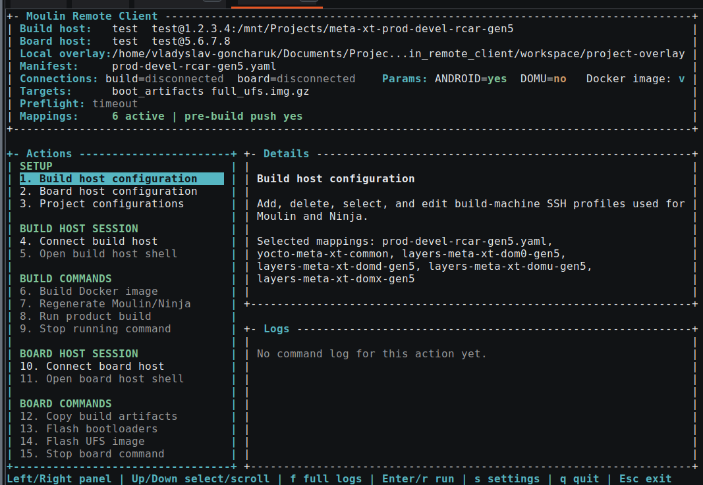
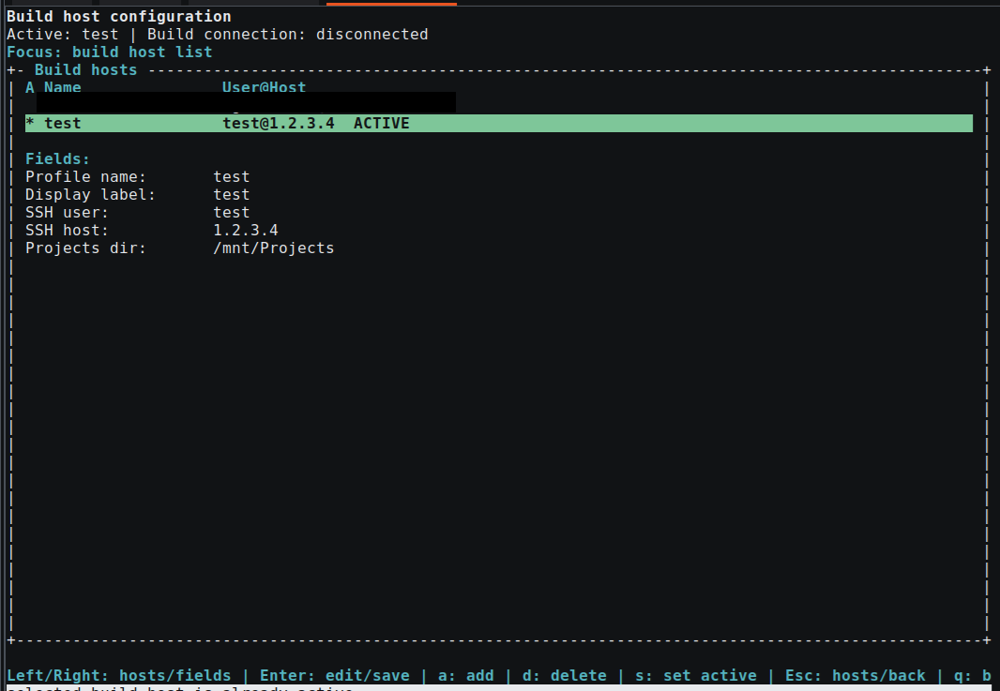
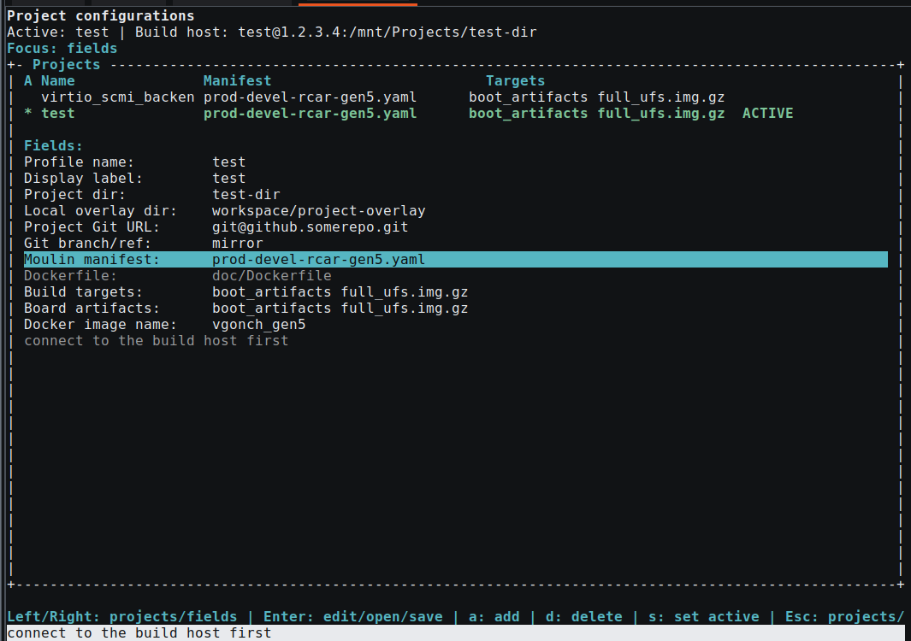
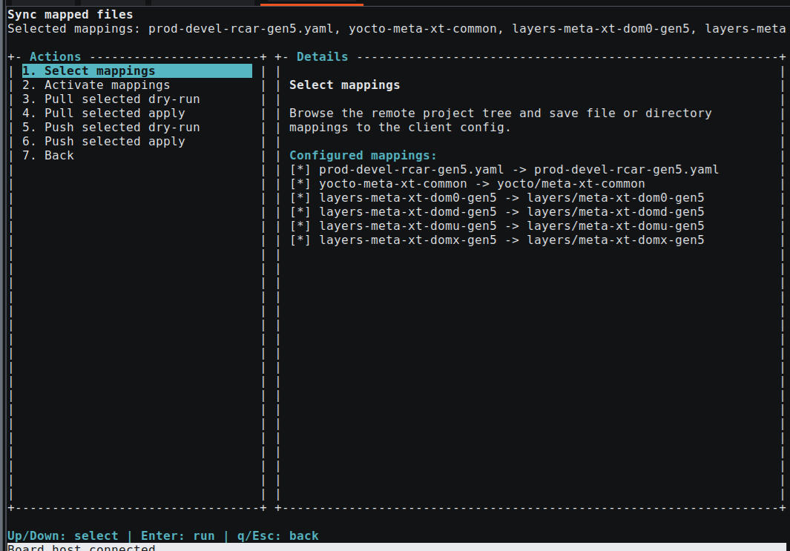
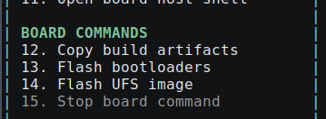

# Moulin Remote Client

## Table of Contents

- [Start With Moulin](#start-with-moulin)
- [Overview](#overview)
- [What It Does](#what-it-does)
- [Repository Layout](#repository-layout)
- [Requirements](#requirements)
- [Installation](#installation)
- [Quick Start](#quick-start)
- [Main Menu](#main-menu)
- [Configuration Model](#configuration-model)
- [Environment Overrides](#environment-overrides)
- [Source Mapping Workflow](#source-mapping-workflow)
- [Build Workflow](#build-workflow)
- [Board Workflow](#board-workflow)
- [Adding a Board Type](#adding-a-board-type)
- [CLI Commands](#cli-commands)
- [Keyboard Reference](#keyboard-reference)
- [Safety Notes](#safety-notes)
- [Troubleshooting](#troubleshooting)
- [Development Notes](#development-notes)

## Start With Moulin

This tool is an add-on for a Moulin-based build environment. It does not
replace Moulin and does not vendor Moulin itself. Before using this client,
become familiar with the upstream Moulin workflow and manifest format:

- Moulin repository: <https://github.com/xen-troops/moulin>
- Moulin documentation: <https://moulin.readthedocs.io/en/latest/>

## Overview

Moulin Remote Client is a local terminal UI for remote Moulin product
development. It keeps the heavy checkout, Docker image, Moulin generation, and
Ninja build on a build host while letting a developer edit a selected local
overlay and push only the active mapped source paths before each build.

The same UI can also operate a board access host: copy selected build artifacts,
flash bootloaders, flash a UFS image, and open build-host or board-host shells
without leaving the client.



## What It Does

- Manages build-host SSH profiles.
- Manages board-host SSH profiles and board type selection.
- Manages per-product project profiles: checkout name, Git URL/ref, Moulin
  manifest, Dockerfile, Docker image, Moulin parameters, Ninja targets, board
  artifacts, and local overlay path.
- Clones or repairs a remote checkout when preflight detects that the checkout
  is missing or points to a different Git origin.
- Reads the Moulin manifest to discover build parameters, targets, Docker image
  hints, and artifact locations where available.
- Lets users select source mappings from the remote project tree and activate
  only the mappings needed for the current task.
- Pushes active mappings from the local overlay to the build host before build
  commands with `rsync -az --delete`.
- Runs Docker image build, Moulin regeneration, and Ninja product builds on the
  build host.
- Copies selected build artifacts to the board host.
- Flashes board bootloaders and UFS images through board-type-specific command
  plans.
- Provides board-type-specific commands. The built-in type is `gen5_x5h`.

## Repository Layout

```text
moulin_remote_client.py              # executable entry point
moulin_remote_client.config.example.json
README.md
board_tools/
  flash_bootloaders.py               # GEN5 X5H adapter deploys and runs it
  xt-imager.py                       # GEN5 X5H adapter deploys it via helper
  gen5_x5h_flash_ufs.py              # wrapper used by the GEN5 X5H board type
components/
  app/                               # bootstrap and dependency wiring
  board/                             # generic board command services
  board_types/                       # board-specific action adapters
  build_runtime/                     # runtime config/env handling
  cli/                               # command-line parser
  config/                            # config normalization/accessors
  host_config_ui/                    # build/board host config screens
  jobs/                              # multi-step command lifecycle
  main_menu/                         # menu item construction
  moulin/                            # Moulin manifest parsing
  project/                           # mappings and project inventory domain
  project_config_ui/                 # project config screens
  project_mapping_ui/                # mapping browser screens
  remote/                            # build-host commands
  sync/                              # mapping sync and pre-build sync
  ui/                                # curses rendering/session state
workspace/                           # local runtime state, ignored by Git
```

## Requirements

Local machine:

- Linux terminal with curses support.
- Python 3.10 or newer. The code is kept compatible with Python 3.10.
- `ssh`, `rsync`, `git`, and `docker` client tools as needed by the workflows.
- Python packages:
  - `PyYAML`, imported as `yaml`, for Moulin manifest parsing.
  - `pyserial`, imported as `serial`, for the vendored flashing helper.

Build host:

- SSH access from the local machine.
- Product checkout storage with enough disk space.
- `git`, `docker`, and `rsync`.
- A working product Dockerfile and Moulin setup.

Board host, only for board commands:

- SSH access from the local machine.
- Access to the target board console and power/boot helper commands required by
  the selected board type.
- For the built-in `gen5_x5h` type, the board host is expected to provide
  X5H helper commands such as `x5h_flash`, `x5h_boot`, and the console device
  `/dev/GEN5_CONSOLE*`.

## Installation

Clone or copy this directory, install the Python dependencies in your preferred
environment, then run the entry point from the tool directory:

```sh
cd moulin_remote_client
python3 -m pip install PyYAML pyserial
./moulin_remote_client.py menu
```

The client stores local state in `moulin_remote_client.config.json`. That file
is intentionally ignored by Git because it contains machine-specific paths,
hosts, user names, and product settings.

## Quick Start

1. Start the TUI:

   ```sh
   ./moulin_remote_client.py menu
   ```

2. Open **Build host configuration**.

   Add or select a build host profile and fill at least `Name`, `Display
   label`, `SSH user`, `SSH host`, and `Projects dir`.

   

3. Open **Project configurations**.

   Add or select the product profile and fill at least `Project dir`, `Local
   overlay dir`, `Project Git URL`, `Git branch/ref`, `Moulin manifest`,
   `Dockerfile`, `Build targets`, and `Board artifacts` when board artifact
   copy should differ from build targets.

   The effective build-host checkout path is:

   ```text
   <build host Projects dir>/<project Project dir>
   ```

   

4. Return to the main menu and connect the build host.

   The header and details panel show project, SSH, Git, Docker, origin, and ref
   status after preflight. If the checkout does not exist or points at a wrong
   origin, the menu offers **Prepare remote project**.

5. Optional: open **Sync mapped files** when you want to edit selected source
   paths locally.

   Use **Select mappings** to browse the remote project tree and save the files
   or directories you want to work on locally. Then use **Activate mappings** to
   choose the active subset for the current task.

   

6. If you activated mappings, run **Pull selected apply** once.

   This creates or refreshes the local overlay from the remote checkout.

7. Edit files in the local overlay.

8. Run **Run product build**.

   Before Docker, Moulin, or Ninja starts, the client pushes active mappings
   from the local overlay back to the build host with `rsync -az --delete`.
   If no mappings are active, pre-build push is skipped and the build runs
   directly on the build host. If a required local mapped path is missing after
   mappings were activated, the build stops before touching the remote tree and
   asks you to pull first.

## Main Menu

The main menu is generated from the active configuration and selected board
type.

### Setup

| Item | Purpose |
| --- | --- |
| Build host configuration | Add, delete, edit, and activate build-machine SSH profiles. |
| Board host configuration | Add, delete, edit, and activate board-access SSH profiles. |
| Project configurations | Add, delete, edit, and activate project profiles; configure product-specific build settings and mappings. |

### Build Host Session

| Item | Purpose |
| --- | --- |
| Connect build host | Check SSH access and run build-host/project preflight. |
| Open build host shell | Open an interactive shell in the remote product directory. |

### Build Commands

| Item | Purpose |
| --- | --- |
| Prepare remote project | Clone or repair the configured checkout when preflight requires it. |
| Checkout project Git ref | Checkout the configured Git ref when preflight requires it. |
| Build Docker image | Run `docker build` on the build host. |
| Regenerate Moulin/Ninja | Run `moulin <manifest>` inside the product Docker container. |
| Run product build | Run `ninja <targets>` inside the product Docker container. |
| Stop running command | Stop the active build/sync command, then force-kill if needed. |

Build commands are multi-step jobs. They stop on the first non-zero step exit.
The log header remains `RUNNING` until the whole sequence finishes or fails.

### Board Host Session

| Item | Purpose |
| --- | --- |
| Connect board host | Check SSH access to the board host. |
| Open board host shell | Open an interactive shell on the board host. |

### Board Commands

The board command list comes from the selected board type. The built-in
`gen5_x5h` type provides:

| Item | Purpose |
| --- | --- |
| Copy build artifacts | Copy configured build artifacts from the build host to the board host. |
| Flash bootloaders | Deploy `flash_bootloaders.py`, unpack boot artifacts, flash bootloaders, and switch the board to boot mode. |
| Flash UFS image | Deploy `xt-imager.py` and `gen5_x5h_flash_ufs.py`, then flash `full_ufs.img.gz` through the board console. |
| Stop board command | Stop the active board command, then force-kill if needed. |



### Sync

| Item | Purpose |
| --- | --- |
| Sync mapped files | Open mapping selection, activation, pull, and push workflows. |

## Configuration Model

Default config path:

```text
moulin_remote_client.config.json
```

If the file does not exist, the client loads
`moulin_remote_client.config.example.json`, normalizes profiles, and writes
local changes to `moulin_remote_client.config.json`.

### Build Host Profile

Build host profiles live under `remotes` and the active profile name is stored
in `active_remote`.

| Field | Meaning |
| --- | --- |
| `name` | Stable local profile id. |
| `label` | Human-readable header label. |
| `user` | SSH user. |
| `host` | SSH host name or IP address. |
| `projects_dir` | Parent directory for remote product checkouts. |

### Board Host Profile

Board host profiles live under `board_hosts` and the active profile name is
stored in `active_board_host`.

| Field | Meaning |
| --- | --- |
| `name` | Stable local profile id. |
| `label` | Human-readable header label. |
| `type` | Board adapter id. Defaults to `gen5_x5h`. |
| `user` | SSH user. |
| `host` | SSH host name or IP address. |
| `work_dir` | Board-host working directory for artifacts and deployed helpers. |
| `console_device` | Serial console path. Empty means auto-detect `/dev/GEN5_CONSOLE*`. |
| `ufs_loadaddr` | Optional `xt-imager.py --loadaddr` override. |
| `ufs_buffersize` | Optional `xt-imager.py --buffersize` override. |
| `direct_copy` | `yes` allows build host to SSH directly to board host for artifact copy. |

### Project Profile

Project profiles live under `projects` and the active profile name is stored in
`active_project`.

| Field | Meaning |
| --- | --- |
| `name` | Stable local project profile id. |
| `label` | Human-readable label. |
| `project_dir` | Product checkout directory name under build host `projects_dir`, or an absolute remote path. |
| `local_project_dir` | Local overlay path. Relative paths are resolved under the tool directory. |
| `git_url` | Product repository URL for prepare/preflight. |
| `git_ref` | Branch, tag, or commit to checkout. |
| `moulin_manifest` | Moulin manifest file inside the product checkout. |
| `dockerfile` | Dockerfile path inside the product checkout. |
| `docker_image` | Docker image name used by build commands. |
| `parameters` | Moulin parameters, for example `ENABLE_ANDROID`. |
| `targets` | Ninja targets for **Run product build**. |
| `board_artifacts` | Artifact labels/targets to copy to the board host. Defaults to `targets` when empty. |
| `mappings` | Saved source mapping definitions for this project. |
| `active_mappings` | Active mapping names used by pull, push, and pre-build sync. |

## Environment Overrides

The following variables override loaded config values for one run:

```sh
MOULIN_REMOTE_SSH_USER=builder
MOULIN_REMOTE_SSH_HOST=build-host
MOULIN_REMOTE_PROJECT_DIR=/mnt/storage/user/projects/product
MOULIN_REMOTE_PROJECT_GIT_URL=git@example.com:org/product.git
MOULIN_REMOTE_PROJECT_GIT_REF=mirror
MOULIN_REMOTE_DOCKER_IMAGE=product-build
MOULIN_REMOTE_BUILD_TARGETS="boot_artifacts full_ufs.img.gz"
MOULIN_REMOTE_AUTO_CONNECT=no
```

`MOULIN_REMOTE_AUTO_CONNECT=no` keeps the TUI responsive at startup when the
network, VPN, or board/build hosts are unavailable.

## Source Mapping Workflow

Mappings are stored in the active project profile, not globally. This lets
different products keep different mapping sets.

Each mapping has:

- `name`
- `remote` path relative to the remote project checkout
- `local` path relative to the local overlay
- `kind`: `file` or `directory`
- `push`: whether local-to-remote push is allowed

Pull uses:

```sh
rsync -az --delete <build-host>:<remote-project>/<mapping>/ <local-overlay>/<mapping>/
```

Push uses:

```sh
rsync -az --delete <local-overlay>/<mapping>/ <build-host>:<remote-project>/<mapping>/
```

Dry-run variants add:

```sh
--dry-run --itemize-changes
```

Configured excludes are passed to rsync. The example config excludes common
large/generated product paths such as `.git/`, `.repo/`, `out/`, `build/`,
`tmp/`, images, downloads, and sstate cache.

Directory mappings use trailing slashes, so rsync synchronizes directory
contents. Because `--delete` is enabled, deleting a local file inside an active
directory mapping deletes the corresponding file on the build host during push.

## Build Workflow

Build commands are run on the build host but driven from the local TUI.

1. If no mappings are active, pre-build sync is skipped.
2. If mappings are active, the client validates the corresponding local overlay
   paths.
3. Active mappings are pushed from local overlay to build host.
4. The requested build command runs on the build host.

The command shapes are:

```sh
# Build Docker image
ssh <build-host> 'cd <remote-project> && docker build <context> -f <dockerfile> ...'

# Regenerate Moulin/Ninja
ssh <build-host> 'cd <remote-project> && docker run ... moulin <manifest> [params]'

# Run product build
ssh <build-host> 'cd <remote-project> && docker run ... ninja <targets>'
```

The Docker run mounts the remote project checkout into the container as
`/home/builder/workspace` and forwards common Git/SSH files from the build host
user home.

## Board Workflow

Board support is intentionally type-based. A board host profile selects a
`type`; the type provides the list of board commands and command plans.

The built-in `gen5_x5h` workflow is:

1. **Copy build artifacts**
   - Resolve artifact paths from the Moulin manifest where possible.
   - Copy selected files/directories to `<board work dir>/artifacts`.
   - If `direct_copy=yes`, stream from build host directly to board host.
   - If `direct_copy=no`, stream through the local machine.
   - Artifact copy uses tar streaming, not rsync. It overwrites matching files
     but does not delete unrelated stale files already present on the board
     host.

2. **Flash bootloaders**
   - Deploy `board_tools/flash_bootloaders.py` to the board host.
   - Run the X5H flash mode helper.
   - Unpack boot artifacts under `<work dir>/artifacts`.
   - Run the helper from `build-domd/ipls`:

     ```sh
     python3 ./flash_bootloaders.py --port /dev/GEN5_CONSOLE --config x5h_bootloaders.yaml --mode all
     ```

   - Switch the board to boot mode.

3. **Flash UFS image**
   - Deploy `board_tools/xt-imager.py`.
   - Deploy `board_tools/gen5_x5h_flash_ufs.py`.
   - Power-cycle and switch the board to boot mode.
   - Auto-detect `/dev/GEN5_CONSOLE*` when no console device is configured.
   - Flash `full_ufs.img.gz` through the vendored imager helper.

Board commands run in the separate board command slot. A build command does not
lock board commands, and a board command does not lock build commands.

## Adding a Board Type

Add one Python module under:

```text
components/board_types/src/builtin/
```

The module must define a `BoardTypeAdapter` subclass with a non-empty
`type_id`. Built-in adapters are discovered automatically; no registry edit is
required.

Minimal skeleton:

```python
from components.board_types.src.base import BoardAction, BoardActionContext, BoardTypeAdapter


class MyBoardAdapter(BoardTypeAdapter):
    type_id = "my_board"
    label = "My Board"
    description = "My board connected through a board host."

    def actions(self, _config: dict[str, object]) -> list[BoardAction]:
        return [
            BoardAction(
                "copy_artifacts",
                "Copy artifacts",
                "Copy build artifacts to this board host.",
                requires_remote=True,
                requires_project=True,
            ),
        ]

    def action_commands(self, ctx: BoardActionContext, action_id: str) -> list[list[str]]:
        if action_id == "copy_artifacts":
            return ctx.transfer_service.copy_build_artifacts_commands(
                ctx.config,
                artifact_targets=ctx.artifact_targets,
                build_params=ctx.build_params or {},
            )
        return super().action_commands(ctx, action_id)
```

Use shared helpers from `BoardActionContext` for generic operations:

- `command_builder` for SSH command construction, remote shell quoting, helper
  deployment, and working-directory creation.
- `transfer_service` for generic artifact copy.

Keep board-specific command ordering, power control, serial console handling,
and flashing logic inside the board adapter or helper scripts owned by that
board type.

After adding a board type, it appears in the **Board host configuration**
`Board type` selector.

## CLI Commands

The TUI is the primary interface:

```sh
./moulin_remote_client.py menu
```

Useful direct commands:

```sh
./moulin_remote_client.py status
./moulin_remote_client.py remote-status
./moulin_remote_client.py build-docker
./moulin_remote_client.py regen-moulin
./moulin_remote_client.py build
./moulin_remote_client.py mappings
./moulin_remote_client.py select-mappings
./moulin_remote_client.py pull-selected-map-dry-run
./moulin_remote_client.py pull-selected-map
./moulin_remote_client.py push-selected-map-dry-run
./moulin_remote_client.py push-selected-map
```

Mapping commands can also target explicit mapping names:

```sh
./moulin_remote_client.py pull-map <name> [<name> ...]
./moulin_remote_client.py push-map <name> [<name> ...]
./moulin_remote_client.py pull-map-dry-run all
./moulin_remote_client.py push-map-dry-run all
```

Use another config file with:

```sh
./moulin_remote_client.py --config /path/to/config.json menu
```

## Keyboard Reference

Common TUI keys:

| Key | Meaning |
| --- | --- |
| Arrow keys / `j` / `k` | Move selection. |
| `Enter` | Run selected action or edit selected field. |
| `Space` | Toggle/select where supported. |
| `Esc` / `q` | Cancel or go back. |
| `f` | Focus logs. |
| `Home` / `End` / Page keys | Navigate long lists/logs where supported. |

Configuration screens show the currently available key hints in the footer.

## Safety Notes

- Do not commit `moulin_remote_client.config.json`; it is local state.
- Review dry-run output before the first push of a new mapping.
- Active directory mappings use `rsync --delete`; remote files can be removed
  when they no longer exist in the local overlay.
- Build and board commands are confirmed before execution.
- Multi-step command sequences stop on the first non-zero step exit.
- UFS flashing is destructive by design. Confirm the active board host and
  board artifacts before running **Flash UFS image**.
- Board helper scripts are vendored in `board_tools/` and deployed to the board
  host work directory when needed.

## Troubleshooting

### The TUI starts slowly or appears stuck

Disable automatic connection for the current run:

```sh
MOULIN_REMOTE_AUTO_CONNECT=no ./moulin_remote_client.py menu
```

Then connect build host and board host explicitly from the menu. This is useful
when VPN is down or the board subnet is unreachable.

### A field accepts pasted text one character at a time

The TUI runs inside curses and terminal paste behavior depends on the terminal
emulator. Prefer editing long paths directly in
`moulin_remote_client.config.json` when a terminal has broken paste behavior,
then restart the client.

### Build command refuses to start because local paths are missing

This only applies after mappings were selected and activated. Run **Sync mapped
files** -> **Pull selected apply** first. The client blocks pre-build push when
active mappings exist but the local overlay does not contain the mapped paths.

For a first build with no source mappings yet, there is nothing to pull or push:
pre-build sync is skipped and the build runs directly in the build-host
checkout.

### Build host can reach board host directly

Set board host `direct_copy` to `yes`. Artifact copy then streams directly:

```text
build host -> board host
```

Otherwise the stream goes through the local client:

```text
build host -> local machine -> board host
```

### Board artifact copy has no byte progress

When `pv` exists on the build host, the direct copy path prints percentage
progress from `pv`. Otherwise the tool uses Python byte progress for direct
copy and may only show coarse output on the non-direct path.

### `Flash UFS image` cannot determine UFS capacity

Check the serial console, board boot mode, and the active bootloader state.
The GEN5 X5H flow expects the board to reach a U-Boot prompt and the UFS device
to appear in `scsi scan`.

## Development Notes

Maintainer release validation lives in
[`docs/release-checklist.md`](docs/release-checklist.md).

The component boundary is service-oriented:

- `components.main_menu` decides what actions are visible.
- `components.jobs` owns command sequence lifecycle and status.
- `components.sync` owns mapping sync and pre-build source push.
- `components.board` owns generic board command services.
- `components.board_types` owns board-specific action lists and command plans.

Keep new product- or board-specific behavior behind project profiles or board
type adapters instead of hardcoding it in the main menu.
