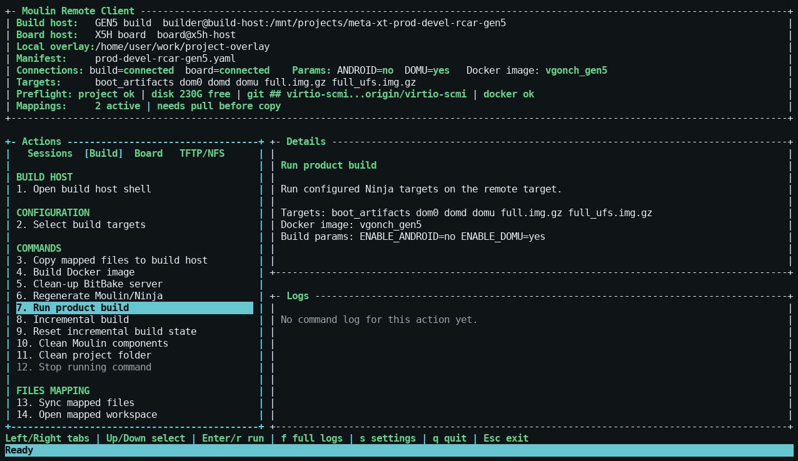
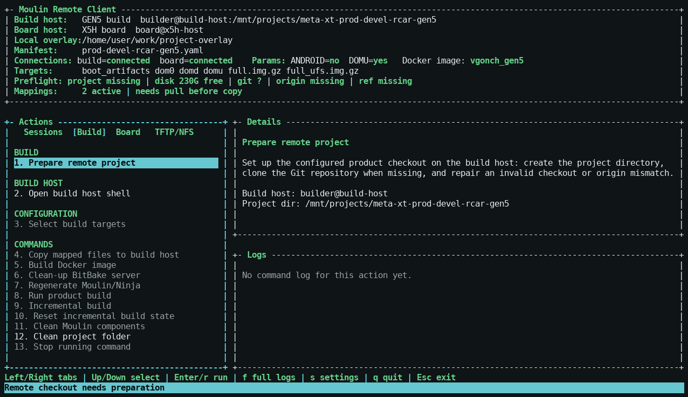
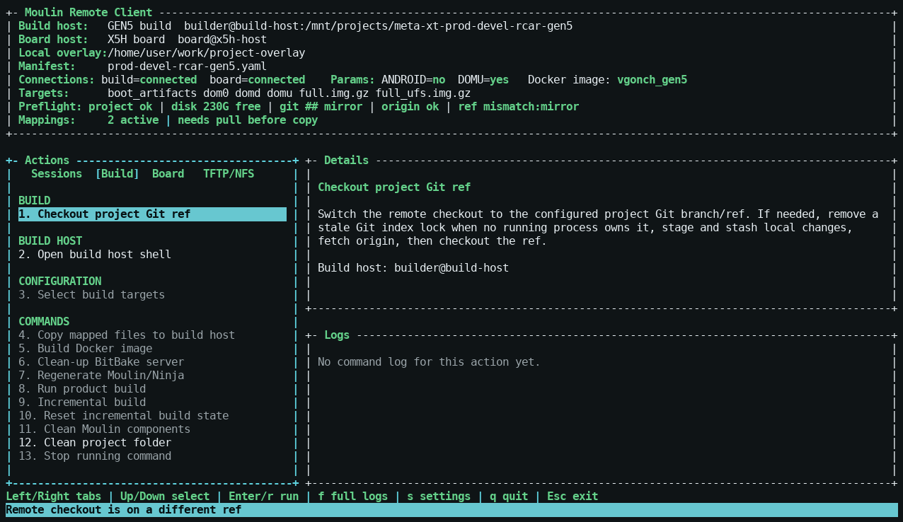
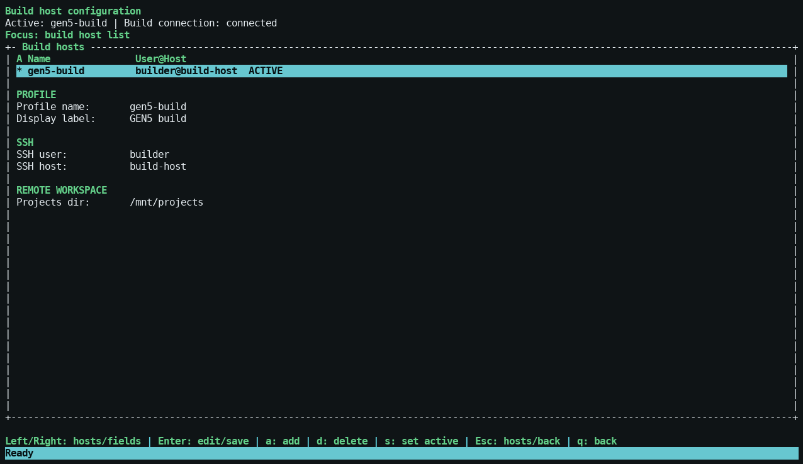
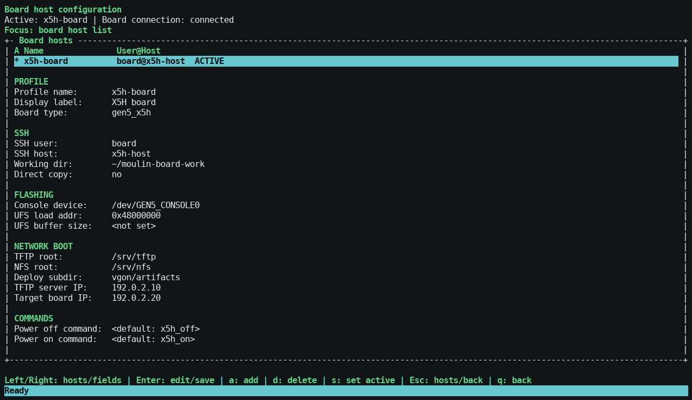
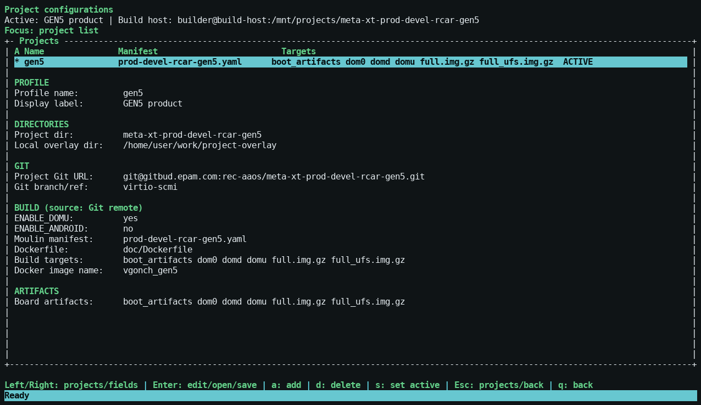
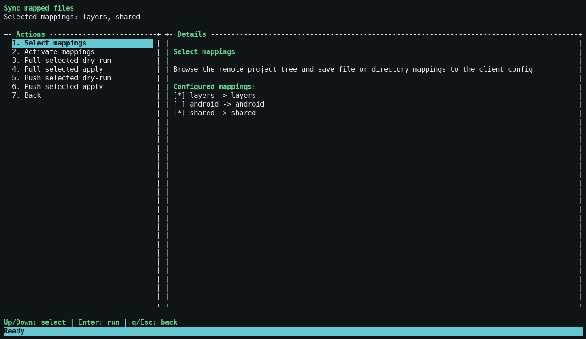
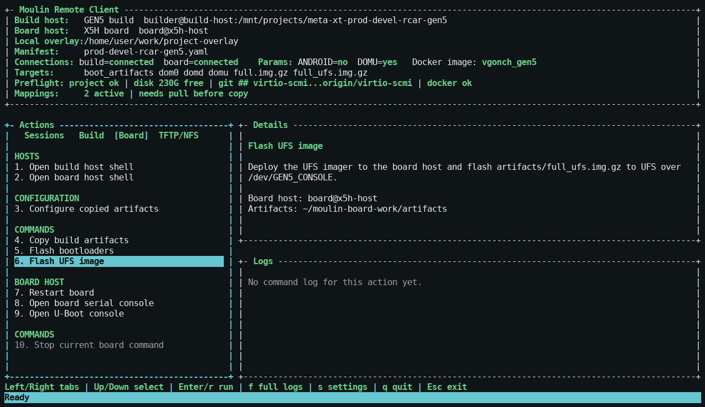
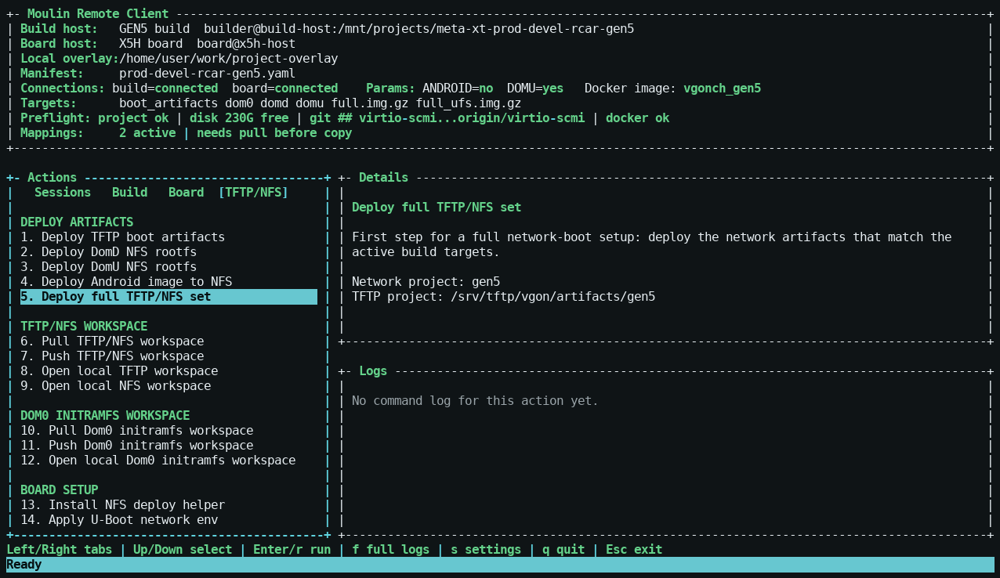

# Moulin Remote Client

## Table of Contents

- [Start With Moulin](#start-with-moulin)
- [Overview](#overview)
- [What It Does](#what-it-does)
- [Repository Layout](#repository-layout)
- [Requirements](#requirements)
- [Installation](#installation)
- [Screenshot Tour](#screenshot-tour)
- [Quick Start](#quick-start)
- [Main Menu](#main-menu)
- [Configuration Model](#configuration-model)
- [Environment Overrides](#environment-overrides)
- [Source Mapping Workflow](#source-mapping-workflow)
- [Build Workflow](#build-workflow)
- [Board Workflow](#board-workflow)
- [Adding a Board Type](#adding-a-board-type)
- [CLI Commands](#cli-commands)
- [Keyboard Reference](#keyboard-reference)
- [Safety Notes](#safety-notes)
- [Development Notes](#development-notes)

## Start With Moulin

This tool is an add-on for a Moulin-based build environment. It does not
replace Moulin and does not vendor Moulin itself. Before using this client,
become familiar with the upstream Moulin workflow and manifest format:

- Moulin repository: <https://github.com/xen-troops/moulin>
- Moulin documentation: <https://moulin.readthedocs.io/en/latest/>

## Overview

Moulin Remote Client is a local terminal UI for remote Moulin product
development. It keeps the heavy checkout, Docker image, Moulin generation, and
Ninja build on a build host while letting a developer edit a selected local
overlay and push only the active mapped source paths before each build.

The same UI can also operate a board access host: copy selected build artifacts,
flash bootloaders, flash a UFS image, and open build-host or board-host shells
without leaving the client.



## What It Does

- Manages build-host SSH profiles.
- Manages board-host SSH profiles and board type selection.
- Manages per-product project profiles: checkout name, Git URL/ref, Moulin
  manifest, Dockerfile, Docker image, Moulin parameters, Ninja targets, board
  artifacts, and local overlay path.
- Clones or repairs a remote checkout when preflight detects that the checkout
  is missing or points to a different Git origin.
- Reads the Moulin manifest to discover build parameters, targets, Docker image
  hints, and artifact locations where available.
- Lets users select source mappings from the remote project tree and activate
  only the mappings needed for the current task.
- Pushes active mappings from the local overlay to the build host before build
  commands with `rsync -az --delete`.
- Runs Docker image build, Moulin regeneration, and Ninja product builds on the
  build host.
- Copies selected build artifacts to the board host.
- Flashes board bootloaders and UFS images through board-type-specific command
  plans.
- Provides board-type-specific commands. The built-in type is `gen5_x5h`.

## Screenshot Tour

The screenshots below are rendered from the real TUI controllers with a fixed
demo configuration, so they show the same layout and availability rules as the
application.

### Main Build Flow

The build tab shows the current build host, project checkout, selected Moulin
parameters, Ninja targets, preflight state, mapping status, action details, and
the last command log.


### Remote Project Preparation

Before build or sync workflows can use a remote checkout, preflight verifies
that the configured project directory exists and matches the expected Git
origin and ref. When the checkout is not ready yet, the menu exposes
**Prepare remote project** and disables checkout-dependent build and sync
actions until preparation completes.



When the checkout exists and only the ref differs, **Checkout project Git ref**
is shown instead.



### Configuration Screens

Build host profiles define SSH access and the parent directory for remote
project checkouts.



Board host profiles define board access, flashing parameters, and network boot
locations.



Project profiles define the product checkout, local overlay, Git ref, Moulin
manifest, build parameters, targets, board artifacts, and mappings.



### Source Sync

The sync screen lets a developer select source mappings, activate the subset
for the current task, pull mapped files locally, and push local edits back to
the build host.



### Board And Network Boot

Board commands are provided by the selected board type.



The TFTP/NFS tab groups network-boot artifact deployment and workspace
maintenance commands.



## Repository Layout

```text
moulin_remote_client.py              # executable entry point
moulin_remote_client.config.example.json
README.md
board_tools/
  flash_bootloaders.py               # GEN5 X5H adapter deploys and runs it
  xt-imager.py                       # GEN5 X5H adapter deploys it via helper
  gen5_x5h_flash_ufs.py              # wrapper used by the GEN5 X5H board type
components/
  app/                               # bootstrap and dependency wiring
  board/                             # generic board command services
  board_types/                       # board-specific action adapters
  build_runtime/                     # runtime config/env handling
  cli/                               # command-line parser
  config/                            # config normalization/accessors
  host_config_ui/                    # build/board host config screens
  jobs/                              # multi-step command lifecycle
  main_menu/                         # menu item construction
  moulin/                            # Moulin manifest parsing
  project/                           # mappings and project inventory domain
  project_config_ui/                 # project config screens
  project_mapping_ui/                # mapping browser screens
  remote/                            # build-host commands
  sync/                              # mapping sync and explicit mapped-file copy
  ui/                                # curses rendering/session state
workspace/                           # local runtime state, ignored by Git
```

## Requirements

Local machine:

- Linux terminal with curses support.
- Python 3.10 or newer. The code is kept compatible with Python 3.10.
- `ssh`, `rsync`, `git`, and `docker` client tools as needed by the workflows.
- Python packages:
  - `PyYAML`, imported as `yaml`, for Moulin manifest parsing.
  - `pyserial`, imported as `serial`, for the vendored flashing helper.

Build host:

- SSH access from the local machine.
- Product checkout storage with enough disk space.
- `git`, `docker`, and `rsync`.
- A working product Dockerfile and Moulin setup.

Board host, only for board commands:

- SSH access from the local machine.
- Access to the target board console and power/boot helper commands required by
  the selected board type.
- For the built-in `gen5_x5h` type, the board host is expected to provide
  X5H helper commands such as `x5h_flash`, `x5h_boot`, and the console device
  `/dev/GEN5_CONSOLE*`.

## Installation

Clone or copy this directory, install the Python dependencies in your preferred
environment, then run the entry point from the tool directory:

```sh
cd moulin_remote_client
python3 -m pip install PyYAML pyserial
./moulin_remote_client.py menu
```

The client stores local state in `moulin_remote_client.config.json`. That file
is intentionally ignored by Git because it contains machine-specific paths,
hosts, user names, and product settings.

## Quick Start

1. Start the TUI:

   ```sh
   ./moulin_remote_client.py menu
   ```

2. Open **Build host configuration**.

   Add or select a build host profile and fill at least `Name`, `Display
   label`, `SSH user`, `SSH host`, and `Projects dir`.

   

3. Open **Project configurations**.

   Add or select the product profile and fill at least `Project dir`, `Local
   overlay dir`, `Project Git URL`, `Git branch/ref`, `Moulin manifest`,
   `Dockerfile`, `Build targets`, and `Board artifacts` when board artifact
   copy should differ from build targets.

   The effective build-host checkout path is:

   ```text
   <build host Projects dir>/<project Project dir>
   ```

   

4. Return to the main menu and connect the build host.

   The header and details panel show project, SSH, Git, Docker, origin, and ref
   status after preflight. If the checkout is missing, empty, not a Git
   checkout, or points at a wrong origin, the menu offers **Prepare remote
   project**. If only the checked-out ref differs, it offers **Checkout project
   Git ref**.

5. Run the initial build flow at least once: **Build Docker image** when the
   image is not available yet, **Regenerate Moulin/Ninja**, then **Run product
   build**.

   This creates the generated project tree on the build host. Mapping
   selection depends on that tree, so the sync screen has little useful content
   before the initial generation/build has populated it.

6. Optional: open **Sync mapped files** when you want to edit selected source
   paths locally.

   Use **Select mappings** to browse the remote project tree and save the files
   or directories you want to work on locally. Then use **Activate mappings** to
   choose the active subset for the current task.

   

7. If you activated mappings, run **Pull selected apply** once.

   This creates or refreshes the local overlay from the remote checkout.

8. Edit files in the local overlay.

9. If you want local overlay changes on the build host, run **Copy mapped files
   to build host**.

   The copy action pushes active mappings from the local overlay back to the
   build host with `rsync -az --delete`. Build actions do not run this copy
   automatically.

10. Run **Run product build**.

## Main Menu

The main menu is generated from the active configuration, connection state,
preflight result, selected build targets, active mappings, and selected board
type. It is organized into tabs rather than a fixed global command list.

### Tabs

| Tab | Contains |
| --- | --- |
| Sessions | Build-host and board-host profile selection, connect/disconnect actions, and interactive shells. |
| Build | Build configuration, source-copy actions, Docker/Moulin/Ninja build commands, incremental build helpers, cleanup actions, and project preparation actions shown by preflight. |
| Board | Board-type commands such as artifact copy, bootloader flashing, UFS flashing, board restart, serial console, and U-Boot console. |
| TFTP/NFS | Network-boot artifact deployment, TFTP/NFS workspace pull/push/open actions, Dom0 initramfs workspace actions, and U-Boot network/UFS environment helpers. |

Configuration screens are opened from the menu and cover build hosts, board
hosts, project profiles, build targets, copied artifacts, and general settings.

Some actions are conditional:

- **Prepare remote project** is shown when preflight says the configured
  checkout is missing, inaccessible, not a Git checkout, or has a wrong origin.
- **Checkout project Git ref** is shown when the checkout exists and only the
  current ref differs from the project profile.
- Board commands come from the selected board type.
- Network deploy and artifact-copy commands use the active board host profile
  and copied-artifact configuration.
- **Stop running command** and **Stop current board command** appear in their
  respective command groups and target separate command slots.

Build commands are multi-step jobs. They stop on the first non-zero step exit.
The log header remains `RUNNING` until the whole sequence finishes or fails.
Command logs show compact step labels by default. Set
`MOULIN_TUI_SHOW_COMMANDS=1` before starting the tool to include full command
and generated script text in the log.

Incremental build and clean commands are described in the
[Build Workflow](#build-workflow) section.

### Availability

The menu keeps configuration actions available even when hosts are disconnected.
Build actions that require a live build host are disabled until the build host
is connected.

When preflight says the remote project needs preparation, build, sync, and
artifact-copy actions that depend on the checkout are disabled. **Prepare
remote project**, **Open build host shell**, **Clean project folder**, and board
flashing actions remain available so a user can inspect or recover the build
host and still use previously copied board artifacts.

When only the Git ref mismatches, **Checkout project Git ref** is shown and
build/sync actions are blocked until the checkout is repaired. Board flashing
actions remain available because they can use already copied artifacts.

## Configuration Model

Default config path:

```text
moulin_remote_client.config.json
```

If the file does not exist, the client loads
`moulin_remote_client.config.example.json`, normalizes profiles, and writes
local changes to `moulin_remote_client.config.json`.

### Build Host Profile

Build host profiles live under `remotes` and the active profile name is stored
in `active_remote`.

| Field | Meaning |
| --- | --- |
| `name` | Stable local profile id. |
| `label` | Human-readable header label. |
| `user` | SSH user. |
| `host` | SSH host name or IP address. |
| `projects_dir` | Parent directory for remote product checkouts. |

### Board Host Profile

Board host profiles live under `board_hosts` and the active profile name is
stored in `active_board_host`.

| Field | Meaning |
| --- | --- |
| `name` | Stable local profile id. |
| `label` | Human-readable header label. |
| `type` | Board adapter id. Defaults to `gen5_x5h`. |
| `user` | SSH user. |
| `host` | SSH host name or IP address. |
| `work_dir` | Board-host working directory for artifacts and deployed helpers. |
| `console_device` | Serial console path. Empty means auto-detect `/dev/GEN5_CONSOLE*`. |
| `ufs_loadaddr` | Optional `xt-imager.py --loadaddr` override. |
| `ufs_buffersize` | Optional `xt-imager.py --buffersize` override. |
| `tftp_root` | Board-host TFTP server root. Defaults to `/srv/tftp`. |
| `nfs_root` | Board-host NFS export root. Defaults to `/srv/nfs`. |
| `deploy_subdir` | Shared subdirectory below TFTP/NFS roots, for example `vgoncharuk/projects`. |
| `server_ip` | TFTP/NFS server IP visible from U-Boot. |
| `board_ip` | Board IP assigned in U-Boot before network boot. |
| `direct_copy` | `yes` allows build host to SSH directly to board host for artifact copy. |

Network deploy commands place files under
`<tftp_root>/<deploy_subdir>/<project-name>` and
`<nfs_root>/<deploy_subdir>/<project-name>`, then update matching `current`
symlinks. Keep U-Boot pointed at the `current` paths to switch projects without
rewriting U-Boot for every deploy.

### Project Profile

Project profiles live under `projects` and the active profile name is stored in
`active_project`.

| Field | Meaning |
| --- | --- |
| `name` | Stable local project profile id. |
| `label` | Human-readable label. |
| `project_dir` | Product checkout directory name under build host `projects_dir`, or an absolute remote path. |
| `local_project_dir` | Local overlay path. Relative paths are resolved under the tool directory. |
| `git_url` | Product repository URL for prepare/preflight. |
| `git_ref` | Branch, tag, or commit to checkout. |
| `moulin_manifest` | Moulin manifest file inside the product checkout. |
| `dockerfile` | Dockerfile path inside the product checkout. |
| `docker_image` | Docker image name used by build commands. |
| `parameters` | Moulin parameters, for example `ENABLE_ANDROID`. |
| `targets` | Ninja targets for **Run product build**. |
| `board_artifacts` | Artifact labels/targets to copy to the board host. Defaults to `targets` when empty. |
| `mappings` | Saved source mapping definitions for this project. |
| `active_mappings` | Active mapping names used by pull, push, and explicit mapped-file copy. |

### Configuration Discovery

Project configuration screens prefer discovered values but keep a manual
fallback:

1. Read the configured checkout on the build host.
2. If that fails or returns no useful candidates, query the configured Git
   remote/ref directly.
3. If discovery still cannot produce candidates, prompt for manual text input.

This applies to Moulin manifest selection, Dockerfile selection, build target
selection, and board artifact selection. Screens that use discovered values
show the source, for example `(source: Git remote)`, when that context is known.

## Environment Overrides

The following variables override loaded config values for one run:

```sh
MOULIN_REMOTE_SSH_USER=builder
MOULIN_REMOTE_SSH_HOST=build-host
MOULIN_REMOTE_PROJECT_DIR=/mnt/storage/user/projects/product
MOULIN_REMOTE_PROJECT_GIT_URL=git@example.com:org/product.git
MOULIN_REMOTE_PROJECT_GIT_REF=mirror
MOULIN_REMOTE_DOCKER_IMAGE=product-build
MOULIN_REMOTE_BUILD_TARGETS="boot_artifacts full_ufs.img.gz"
MOULIN_REMOTE_AUTO_CONNECT=no
```

`MOULIN_REMOTE_AUTO_CONNECT=no` keeps the TUI responsive at startup when the
network, VPN, or board/build hosts are unavailable.

## Source Mapping Workflow

Mappings are stored in the active project profile, not globally. This lets
different products keep different mapping sets.

Each mapping has:

- `name`
- `remote` path relative to the remote project checkout
- `local` path relative to the local overlay
- `kind`: `file` or `directory`
- `push`: whether local-to-remote push is allowed

Pull uses:

```sh
rsync -az --delete <build-host>:<remote-project>/<mapping>/ <local-overlay>/<mapping>/
```

Push uses:

```sh
rsync -az --delete <local-overlay>/<mapping>/ <build-host>:<remote-project>/<mapping>/
```

Dry-run variants add:

```sh
--dry-run --itemize-changes
```

Configured excludes are passed to rsync. The example config excludes common
large/generated product paths such as `.git/`, `.repo/`, `out/`, `build/`,
`tmp/`, images, downloads, and sstate cache.

Directory mappings use trailing slashes, so rsync synchronizes directory
contents. Because `--delete` is enabled, deleting a local file inside an active
directory mapping deletes the corresponding file on the build host during push.

After selecting and activating mappings, run **Pull selected apply** before the
first **Copy mapped files to build host**. The copy action expects the active
mapped paths to exist in the local overlay. For a first build with no active
source mappings yet, there is nothing to pull or push: run the build directly
in the build-host checkout.

## Build Workflow

Build commands are run on the build host but driven from the local TUI.

1. Connect the build host. The connection step also runs project preflight.
2. If preflight offers **Prepare remote project**, run it before build/sync
   commands. It clones missing checkouts and accepts empty existing target
   directories. It refuses non-empty non-Git directories and tells the user to
   clean or remove the directory first.
3. If preflight offers **Checkout project Git ref**, run it before build/sync
   commands. The checkout flow handles a stale `.git/index.lock`, stages and
   stashes local changes, fetches origin, and checks out the configured ref.
4. Optional: run **Copy mapped files to build host** when local overlay changes
   should be pushed to the remote checkout.
5. The requested build command runs on the build host. Build commands do not
   copy mapped files automatically.

### Incremental Build

**Incremental build** starts with a component selector. `yocto`, `bazel`, and
`android` builders are supported. Other builder types are shown disabled until
a builder-specific incremental flow is added.

For copied source mappings, the client tracks which mapped files are already
accounted for by the last successful build. A regular copy updates the remote
working tree and records which files changed relative to that state. A
successful incremental build then advances the state for the selected
incremental components.

For Yocto components, the incremental flow maps changed layer paths back to
recipes and runs cleansstate for the impacted recipes before regenerating
Moulin/Ninja and running the selected Ninja targets. Some final image recipes
are build targets rather than directly changed files, so they may not appear in
the impacted-recipe list. The incremental flow also reads
`yocto_image_recipes`; any recipe names listed there, for example
`rcar-image-adas xt-rcar-image`, are cleaned together with the directly
impacted recipes.

**Reset incremental build state** forgets the tracked copied-file state. The
next incremental build treats all active mapped files as not yet accounted for
by the build, so the recipe/component impact calculation starts from the full
active mapping set.

### Cleaning Build State

**Clean Moulin components** asks for the Moulin components to clean and runs
the corresponding generated clean targets on the build host. It is useful when
the generated Ninja graph is still valid but selected build outputs need to be
rebuilt from scratch.

**Clean-up BitBake server** stops the remote BitBake server for the configured
Yocto build directory.

**Clean project folder** removes the configured remote project checkout after
confirmation. This is a build-host workspace cleanup action; it does not clean
board artifacts or local source mappings.

The command shapes are:

```sh
# Build Docker image
ssh <build-host> 'cd <remote-project> && docker build <context> -f <dockerfile> ...'

# Regenerate Moulin/Ninja
ssh <build-host> 'cd <remote-project> && docker run ... moulin <manifest> [params]'

# Run product build
ssh <build-host> 'cd <remote-project> && docker run ... ninja <targets>'
```

The Docker run mounts the remote project checkout into the container as
`/home/builder/workspace` and forwards common Git/SSH files from the build host
user home.

## Board Workflow

Board support is intentionally type-based. A board host profile selects a
`type`; the type provides the list of board commands and command plans.

The built-in `gen5_x5h` workflow is:

1. **Copy build artifacts**
   - Resolve artifact paths from the Moulin manifest where possible.
   - Copy selected files/directories to `<board work dir>/artifacts`.
   - If `direct_copy=yes`, stream from build host directly to board host:

     ```text
     build host -> board host
     ```

   - If `direct_copy=no`, stream through the local machine:

     ```text
     build host -> local machine -> board host
     ```

   - Artifact copy uses tar streaming, not rsync. It overwrites matching files
     but does not delete unrelated stale files already present on the board
     host.

2. **Flash bootloaders**
   - Deploy `board_tools/flash_bootloaders.py` to the board host.
   - Run the X5H flash mode helper.
   - Unpack boot artifacts under `<work dir>/artifacts`.
   - Run the helper from `build-domd/ipls`:

     ```sh
     python3 ./flash_bootloaders.py --port /dev/GEN5_CONSOLE --config x5h_bootloaders.yaml --mode all
     ```

   - Switch the board to boot mode.

3. **Flash UFS image**
   - Deploy `board_tools/xt-imager.py`.
   - Deploy `board_tools/gen5_x5h_flash_ufs.py`.
   - Power-cycle and switch the board to boot mode.
   - Auto-detect `/dev/GEN5_CONSOLE*` when no console device is configured.
   - Flash `full_ufs.img.gz` through the vendored imager helper.

Board commands run in the separate board command slot. A build command does not
lock board commands, and a board command does not lock build commands.

## Adding a Board Type

Add one Python module under:

```text
components/board_types/src/builtin/
```

The module must define a `BoardTypeAdapter` subclass with a non-empty
`type_id`. Built-in adapters are discovered automatically; no registry edit is
required.

Minimal skeleton:

```python
from components.board_types.src.base import BoardAction, BoardActionContext, BoardTypeAdapter


class MyBoardAdapter(BoardTypeAdapter):
    type_id = "my_board"
    label = "My Board"
    description = "My board connected through a board host."

    def actions(self, _config: dict[str, object]) -> list[BoardAction]:
        return [
            BoardAction(
                "copy_artifacts",
                "Copy artifacts",
                "Copy build artifacts to this board host.",
                requires_remote=True,
                requires_project=True,
            ),
        ]

    def action_commands(self, ctx: BoardActionContext, action_id: str) -> list[list[str]]:
        if action_id == "copy_artifacts":
            return ctx.transfer_service.copy_build_artifacts_commands(
                ctx.config,
                artifact_targets=ctx.artifact_targets,
                build_params=ctx.build_params or {},
            )
        return super().action_commands(ctx, action_id)
```

Use shared helpers from `BoardActionContext` for generic operations:

- `command_builder` for SSH command construction, remote shell quoting, helper
  deployment, and working-directory creation.
- `transfer_service` for generic artifact copy.

Keep board-specific command ordering, power control, serial console handling,
and flashing logic inside the board adapter or helper scripts owned by that
board type.

After adding a board type, it appears in the **Board host configuration**
`Board type` selector.

## CLI Commands

The TUI is the primary interface:

```sh
./moulin_remote_client.py menu
```

Useful direct commands:

```sh
./moulin_remote_client.py status
./moulin_remote_client.py remote-status
./moulin_remote_client.py build-docker
./moulin_remote_client.py regen-moulin
./moulin_remote_client.py build
./moulin_remote_client.py yocto-impact
./moulin_remote_client.py yocto-impact-clean
./moulin_remote_client.py yocto-impact-rebuild
./moulin_remote_client.py yocto-impact-clean-rebuild
./moulin_remote_client.py mappings
./moulin_remote_client.py select-mappings
./moulin_remote_client.py pull-selected-map-dry-run
./moulin_remote_client.py pull-selected-map
./moulin_remote_client.py push-selected-map-dry-run
./moulin_remote_client.py push-selected-map
```

Mapping commands can also target explicit mapping names:

```sh
./moulin_remote_client.py pull-map <name> [<name> ...]
./moulin_remote_client.py push-map <name> [<name> ...]
./moulin_remote_client.py pull-map-dry-run all
./moulin_remote_client.py push-map-dry-run all
```

Use another config file with:

```sh
./moulin_remote_client.py --config /path/to/config.json menu
```

## Keyboard Reference

Common TUI keys:

| Key | Meaning |
| --- | --- |
| Arrow keys / `j` / `k` | Move selection. |
| `Enter` | Run selected action or edit selected field. |
| `Space` | Toggle/select where supported. |
| `Esc` / `q` | Cancel or go back. |
| `f` | Focus logs. |
| `Home` / `End` / Page keys | Navigate long lists/logs where supported. |

Configuration screens show the currently available key hints in the footer.

## Safety Notes

- Do not commit `moulin_remote_client.config.json`; it is local state.
- Review dry-run output before the first push of a new mapping.
- Active directory mappings use `rsync --delete`; remote files can be removed
  when they no longer exist in the local overlay.
- Destructive cleanup commands ask for confirmation before execution.
- Multi-step command sequences stop on the first non-zero step exit.
- **Clean project folder** removes the configured remote project checkout
  directory. The command refuses empty, root, home, non-directory, and unsafe
  basename targets, but it is still destructive for a valid project directory.
- UFS flashing is destructive by design. Confirm the active board host and
  board artifacts before running **Flash UFS image**.
- Board helper scripts are vendored in `board_tools/` and deployed to the board
  host work directory when needed.

## Development Notes

Maintainer release validation lives in
[`docs/release-checklist.md`](docs/release-checklist.md).

README screenshots are rendered from the same TUI controllers used by the
application. Refresh them after UI changes with:

```sh
python3 scripts/render_readme_screenshots.py
```

The component boundary is service-oriented:

- `components.main_menu` decides what actions are visible.
- `components.jobs` owns command sequence lifecycle and status.
- `components.sync` owns mapping sync and explicit mapped-file copy.
- `components.board` owns generic board command services.
- `components.board_types` owns board-specific action lists and command plans.

Keep new product- or board-specific behavior behind project profiles or board
type adapters instead of hardcoding it in the main menu.
